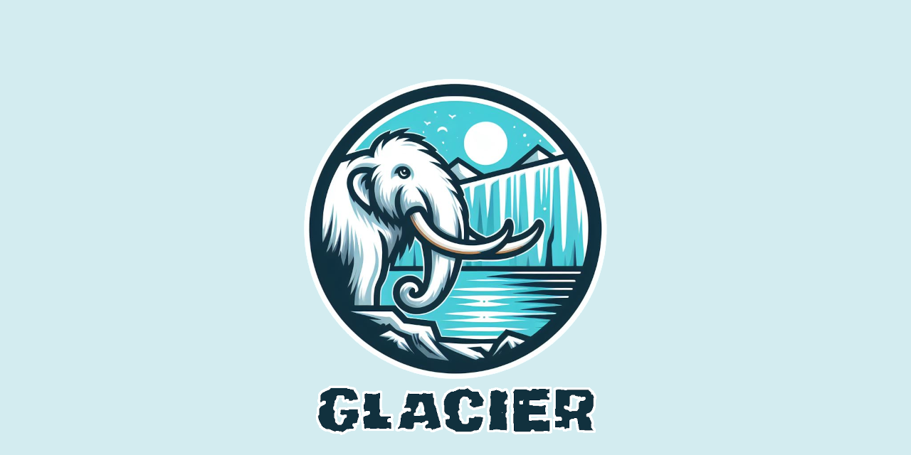
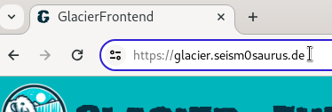
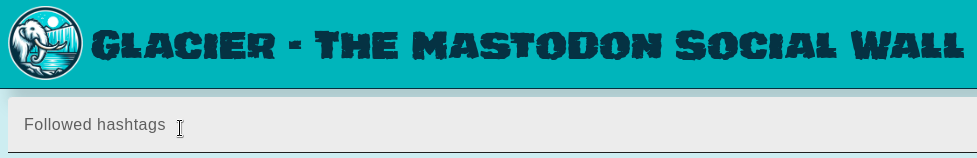
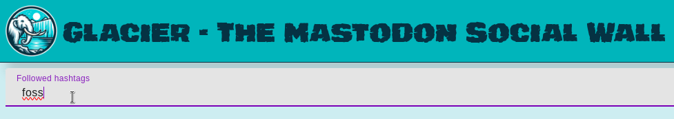
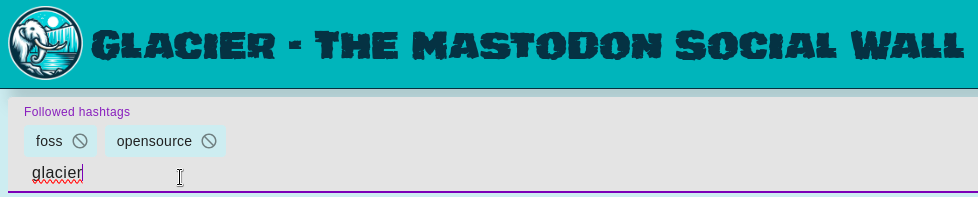
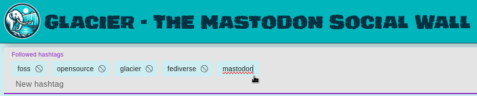
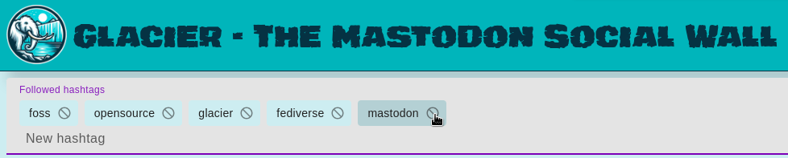
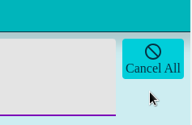

# Glacier

*A Mastodon and Fediverse social wall.*

With **Glacier** you can follow hashtags and see the interaction of event participants in realtime.

Feel free to [open an issue](https://github.com/seism0saurus/glacier/issues) to report any problems.

## Contents

- [Try the demo](#try-the-demo)
- [Use it](#use-it)
  - [Create a Glacier Wall](#create-a-glacier-wall)
  - [Add toots](#add-toots)
  - [Share your wall](#share-your-wall)
- [Accessibility](#accessibility)
- [Concepts and wordings](#concepts-and-wordings)
- [Known issues and limitations](#known-issues-and-limitations)
- [Licences](#licences)
- [Thank you](#thank-you)
- [Further documentation](#further-documentation)

## Try the demo

A free, publicly accessible demo of **Glacier** is available at [glacier.events](https://glacier.events).

The demo always runs the latest stable version from the main branch.

[](https://github.com/seism0saurus/glacier/actions/workflows/build-and-deploy.yml)

## Use it

### Create a Glacier Wall

1. Go to your Glacier instance, e.g. [glacier.events](https://glacier.events)

   

2. Click into the field *Followed hashtags*

   

3. Enter a hashtag you want to follow and press *Enter*. Repeat for each hashtag you want to follow.

   
   

4. To correct a tag, double-click on it, edit the text, and press *Enter*.

   

5. To remove a hashtag, click the small symbol after its text. The button on the right removes all hashtags at once.

   
   

6. For a better view, enable full-screen mode with *F11* or your browser's menu.

### Add toots

1. Start a new toot.
2. Mention the bot of your Glacier instance — for example `@glacier@glacier.events`. This is necessary because not all hashtag toots are federated to the bot's server.
3. Use one of the hashtags from your Glacier Wall, e.g. `#flowers`.
4. Post the toot. It will appear on the wall within a few seconds.

Example toot:
```
@glacier@glacier.events

Hi, very cool project. Thanks for developing a social wall ;)

#foss #opensource #mastodon
```


### Share your wall

You can share a read-only view of your wall with others — useful for displaying it on a projector or a second screen while you keep the editable version open yourself.

1. Click the **Share** button on your wall.
2. A shareable link and QR code are generated. The link points to `share.{instance}`, e.g. `share.glacier.events`.
3. Anyone who opens the link sees the same live toot stream as your wall, without being able to change the hashtags.
4. Share links expire after 7 days and can be deleted at any time.

The share view is also the **accessible version** of your wall: it renders toot content natively instead of as iframes, making it fully compatible with screen readers and comfortable to use on mobile phones. See [Accessibility](#accessibility) for details.

> Your wall state (hashtags and recent toots) is automatically saved in your browser's local storage. Reloading the page or reopening the tab restores your wall exactly as you left it.

## Accessibility

The main Glacier Wall embeds each toot as an **iframe** from its original Fediverse server. While this preserves the original styling, iframes can be difficult to navigate with a screen reader or on a small mobile screen.

The **share view** — the read-only page generated by the Share button — is built for accessibility:

- Toot content is rendered as native HTML, not inside iframes. A screen reader can read each post directly.
- The toot list uses [`role="feed"`](https://www.w3.org/WAI/ARIA/apg/patterns/feed/) with `aria-busy` so assistive technologies understand that new items arrive dynamically.
- New toots are announced through a [live region](https://developer.mozilla.org/en-US/docs/Web/Accessibility/ARIA/ARIA_Live_Regions) without interrupting whatever is currently being read.
- Skip links allow keyboard users to jump directly to the feed or to the status banner.
- The page has a clear heading hierarchy and no nested scroll containers.

**Recommended setup at events:** the wall owner opens the main wall on the presentation screen, then shares the QR code (shown in the Share dialog) so attendees can scan it on their phone. Anyone using a screen reader or preferring a mobile-friendly view can follow the wall live via the share link, completely independently of the main display.

## Concepts and wordings

- **Glacier** — The name is related to mammoths (Mastodon's mascot) which lived in the ice age. A social wall application for Mastodon and the Fediverse.
- **Glacier instance** — One deployment of the Glacier web application. A single instance serves multiple Glacier Walls for different users; for example, [glacier.events](https://glacier.events) is a public instance.
- **Glacier Wall** — One personal social wall tied to your browser and a Glacier instance. Opening the same instance in two different browsers gives two separate walls with independent hashtags.
- **Toot** — A post on Mastodon. Glacier can display posts from other Fediverse systems too, but the documentation uses "toot" for simplicity.

## Known issues and limitations

- The wall needs a few seconds after a new toot arrives to re-render. Toots are shown as iframes so that each Fediverse server's own styling is preserved; moving a toot to another column forces the browser to reload it.
- Cookie consent banners on individual Fediverse servers can cover the content inside the iframe.
- Content warnings in Mastodon hide the content on the wall until clicked.
- Some Mastodon instances send incorrect `Content-Security-Policy` or `X-Frame-Options` headers that prevent embedding. If your publicly-visible toots are not appearing, please open an issue.
- Toots that never federate to the bot's server are invisible to Glacier — that is why mentioning the bot directly is required.
- Private or restricted posts are never shown on a Glacier Wall.

## Versioning and releases

Releases are cut as annotated git tags (`v<major>.<minor>.<patch>`), not release branches.
Version bumps are managed with the `push_version.sh` script:

```bash
./push_version.sh <version>   # e.g. ./push_version.sh 0.0.9
```

The script bumps `pom.xml`, `README.md` (jar filename), and `frontend/package.json` /
`package-lock.json` together in a single commit, then creates the annotated tag
`v<version>` locally — **it does not push anything itself**. Review the commit, then push
explicitly when you are ready to release:

```bash
git push origin HEAD
git push origin v<version>
```

Pushing the tag triggers `build-and-deploy.yml`, which builds, tests, and — once the full
e2e and security-scan gate passes — publishes and deploys the release. See the
[maintainer guide](docs/MAINTAINER.md#bei-releases) for the complete release pipeline.

**Changing only one of the version-bearing files breaks version consistency** — always use
`push_version.sh` rather than editing them individually.

## Operational modes

Glacier has four operational modes. As an end-user you usually cannot tell the difference
between live and fallback — both show real toots in near-real-time. If you are an operator,
refer to [docs/ADMIN.md](docs/ADMIN.md) for the configuration variables.

| Mode | How it works |
|---|---|
| **Live** (default) | Real-time Mastodon streaming via WebSocket. Toots appear within seconds of posting. |
| **Fallback** | Glacier falls back to polling when streaming is interrupted. Toots may appear with a short delay. The wall shows a status indicator when in fallback mode. |
| **Killswitch** | Operator has fully disabled the fallback path (`glacier.fallback.enabled=false`). Only live streaming is active; if streaming fails the wall shows no new toots until streaming recovers. |
| **Insecure transport** | `glacier.cookie.secure=false` — intended for local development only without HTTPS. The `wallId` cookie is issued without the `Secure` flag. Never use in production. |

## Licences

This project is Open Source under the [MIT License](LICENSE) except for:
- The font [Jugger Rock](frontend/src/assets/juggerrock.ttf) by Dan Zadorozny — not for commercial use without a [license](https://www.iconian.com/commercial.html).
- The [Mastodon Logo](frontend/src/assets/mastodon.svg) from [Wikimedia](https://commons.wikimedia.org/wiki/File:Font_Awesome_5_brands_mastodon.svg) under the [CC BY 4.0](https://creativecommons.org/licenses/by/4.0/) license.

## Thank you

**Mastodon** — Many thanks to Gargron (Eugen Rochko) and all contributors to [Mastodon](https://github.com/mastodon/mastodon) and the Fediverse.

**bigbone** — Thanks to André Gasser, the current maintainers, and all contributors for the [bigbone Mastodon client for Java](https://github.com/PattaFeuFeu/bigbone), which made streaming support straightforward to implement.

## Further documentation

| Audience | Document |
|---|---|
| Operators deploying their own instance | [Admin guide](docs/ADMIN.md) |
| Developers contributing to Glacier | [Developer guide](docs/DEVELOPER.md) |
| Maintainers of the CI/CD pipeline and releases | [Maintainer guide](docs/MAINTAINER.md) |

---

### How this project is built

Glacier is **planned and approved by a human maintainer**. Architecture decisions, feature scope, security requirements, UX direction, and acceptance criteria are authored and signed off by the maintainer before any code is written. **AI coding assistants help with the implementation**: they draft code, tests, and documentation within the bounds of an approved plan, and their output is reviewed by the maintainer before it lands. Every design decision, every change of scope, and every acceptance disposition is recorded in `docs/decisions/` so the human-in-the-loop trail is auditable.

> I, seism0saurus, am aware of the ethical and ecological problems of AI — the inherent bias, theft, concentration of power, and resource usage.
> My goal is to deliver great software for humans and to understand the mechanics behind it.
> But I also build this in my free time and have other responsibilities, and my expertise is backend development, devops practices, and security. Although I can build frontends with angular, they are not as good as I would like them to be.
> So after years of manually crafting software, I experiment with AI agents, which discuss problems from different points of view.
> If you want to participate in the development, please try to use AI as responsibly as possible and do a manual code review of any generated code. Mark commits, so we can distinguish AI contributions.
> I'm not sure if this is the right thing to do, but I want to learn more about the capabilities and dangers of AI.
> Thank you for your understanding.
