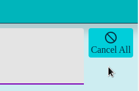

# Glacier

*A mastodon and fediverse social wall.*

With **Glacier** you can follow hashtags to see the interaction of participants of an event in realtime.

Glacier ist still **BETA**. You can use it, but there could be some minor errors. Feel free to open an issue here on GitHub, to report any problems.

## Content

- [Licences](#licences)
- [Try it](#try-it)
  - [Demo](#demo)
- [Build it](#build-it)
  - [Requirements](#requirements)
    - [Build Jar](#build-jar)
    - [Build container image](#build-container-image)
      - [Docker](#docker)
      - [Buildah](#buildah)
- [Test it](#test-it)
- [Run it](#run-it)
  - [Container Image](#container-image)
    - [INSTANCE](#instance)
    - [HANDLE](#handle)
    - [ACCESS_KEY](#access_key)
    - [MY_DOMAIN](#my_domain)
    - [Docker](#docker-1)
    - [Containerd with nerdctl](#containerd-with-nerdctl)
- [Use it](#use-it)
  - [Create a Glacier Wall](#create-a-glacier-wall)
  - [Add toots](#add-toots)
- [Concepts and wordings](#concepts-and-wordings)
- [Thank you](#thank-you)
- [Known issues or limitations](#known-issues-or-limitations)

## Licences

This project is Open Source under the [MIT License](LICENSE) except for the following files:
- The font [Jugger Rock](frontend/src/assets/juggerrock.ttf), which is from Dan Zadorozny and may not be used for commercial purposes without a [license](https://www.iconian.com/commercial.html).
- The [Mastodon Logo](frontend/src/assets/mastodon.svg), which is from [Wikimedia](https://commons.wikimedia.org/wiki/File:Font_Awesome_5_brands_mastodon.svg)
and is under the [CC BY 4.0 Deed license](https://creativecommons.org/licenses/by/4.0/).

## Try it

### Demo

A complete free usable test installation of **glacier** will be available soon under [glacier.seism0saurus.de](https://glacier.seism0saurus.de).

The demo page always contains the last stable version from the main branch.

[](https://github.com/seism0saurus/glacier/actions/workflows/build-and-deploy.yml)

## Build it

### Requirements

Glacier is built with maven and based on Java 21 and typescript.
To execute the built or run Glacier locally you need a Java 21 JDK.
A JRE is not sufficient for build. I recommend [Temurin](https://adoptium.net/de/temurin/releases/).

### Build Jar

To check out the code and do a complete installation including frontend and backend build and tests, run the following commands.
```bash
git clone git@github.com:seism0saurus/glacier.git
cd glacier
./mvnw clean package
```

After the build you can run Glacier locally from the commandline, to test the jar before packaging it into a container image.
```bash
ACCESS_KEY=my-secret-mastodon-api-key -e HANDLE=my-mastodon-handle -e INSTANCE=my-mastodon-instance -e MY_DOMAIN=localhost:8080 java -jar target/glacier-0.0.8.jar
```

### Run tests

When glacier is running you can execute the e2e tests. You should install dependencies by calling `npx playwright install --with-deps` in the `frontend` folder.
After that run all tests with maven verify.
```bash
./mvnw verify
```

### Build container image

First create the jar.
To create a container image for Docker or other engines,
copy the created jar into the [infrastructure/glacier](infrastructure/glacier) folder.
Then change into the folder and run docker build.
```bash
cp target/glacier-0.0.8.jar containerimage/
cd containerimage
```

To build the image you can use Docker
or any compatible build tool that creates standard container images like [buildah](https://buildah.io/).

#### Docker

```bash
docker build -t glacier --build-arg JAR_FILE=glacier-0.0.8.jar .
```

#### Buildah

```bash
buildah build --build-arg JAR_FILE=glacier-0.0.8.jar  -f Dockerfile -t glacier .
```

## Test it

You can run unit tests by executing the maven goal `test`.

For e2e tests see [E2E_TESTING.md](infrastructure/README)

## Run it

### Container Image

A container image with latest stable version is available: [ghcr.io/seism0saurus/glacier:main](https://ghcr.io/seism0saurus/glacier:main)
Or you can build your own version with the steps from Build it.

You can run the image locally with docker or other compatible container runtimes.
Four environment variables are needed.

#### INSTANCE

The instance is the mastodon instance with your account. You need an account to connect to the fediverse via the mastodon API.
For example *infosec.exchange* or *botsin.space*.

#### HANDLE

The handle is the mastodon handle of your account. The handle consists of your account name and the mastodon instance.
For example *glacier@mastodon.seism0saurus.de*.

#### ACCESS_KEY

The access key for your mastodon account.
Go to your mastodon instance into the account settings and select applications.
Create a new application with read access.

#### MY_DOMAIN

The domain of your personal Glacier installation.
If run locally use your hostname or localhost.
For non http ports add the port to the hostname for correct redirects and checks.
For example *localhost:8080*.
You can use Docker or any other compatible container runtime like [containerd](https://containerd.io/) with [nerdctl](https://github.com/containerd/nerdctl).

#### MY_NAME

The name is used for the Legal Notice and the GDPR.
You are the operator of your instance and responsible for logging and using data like IP addresses in your instance.
Therefore, in some countries like Germany you have to provide your name in the appropriate entry on a website.

#### MY_STREET_AND_NUMBER

The street and house number is part of your address and is used for the Legal Notice and the GDPR.
You are the operator of your instance and responsible for logging and using data like IP addresses in your instance.
Therefore, in some countries like Germany you have to provide your address in the appropriate entry on a website.

#### MY_ZIP_CODE

The zip code is part of your address and is used for the Legal Notice and the GDPR.
You are the operator of your instance and responsible for logging and using data like IP addresses in your instance.
Therefore, in some countries like Germany you have to provide your address in the appropriate entry on a website.

#### MY_CITY

The city is part of your address and is used for the Legal Notice and the GDPR.
You are the operator of your instance and responsible for logging and using data like IP addresses in your instance.
Therefore, in some countries like Germany you have to provide your address in the appropriate entry on a website.

#### MY_COUNTRY

The country is part of your address and is used for the Legal Notice and the GDPR.
You are the operator of your instance and responsible for logging and using data like IP addresses in your instance.
Therefore, in some countries like Germany you have to provide your address in the appropriate entry on a website.

#### MY_PHONE

The phone number is used for the Legal Notice and the GDPR.
You are the operator of your instance and responsible for logging and using data like IP addresses in your instance.
Therefore, in some countries like Germany you have to provide your phone number in the appropriate entry on a website.

#### MY_MAIL

The contact email address is used for the Legal Notice and the GDPR.
You are the operator of your instance and responsible for logging and using data like IP addresses in your instance.
Therefore, in some countries like Germany you have to provide your email address in the appropriate entry on a website.

#### MY_WEBSITE

The website is used for the Legal Notice and the GDPR.
Give the users the possibility to learn more about you or your organisation.

#### Docker

```bash
docker run -ti -e ACCESS_KEY=my-secret-mastodon-api-key -e HANDLE=my-mastodon-handle -e INSTANCE=my-mastodon-instance -e MY_DOMAIN=localhost:8080 -p 8080:8080 ghcr.io/seism0saurus/glacier:main
```

#### Containerd with nerdctl

```bash
nerdctl run -ti -e ACCESS_KEY=my-secret-mastodon-api-key -e HANDLE=my-mastodon-handle -e INSTANCE=my-mastodon-instance -e MY_DOMAIN=localhost:8080 -p 8080:8080 ghcr.io/seism0saurus/glacier:main
```


## Use it

### Create a Glacier Wall

To create a new Glacier Wall follow these steps.

1) Go to your Glacier instance. E.g. [glacier.seism0saurus.de](https://glacier.seism0saurus.de)

   
2) Click into the field *Followed hashtags*

   
3) Enter a hashtag you want to follow and press *enter*. Repeat this for each hashtag you want to follow

   
   
4) You can also edit a tag, if you misspelled it. Double klick on the hashtag and you can change it. Press *enter* after that

   
5) To delete a hashtag, klick on the small symbol after its text in the chip

    
   On the right is also a button to remove all hashtags and start from the beginning

   
6) For better usage of space, enable the full screen mode with *F11* or the menu of your web browser

### Add toots

To add a toot to your Glacier Wall follow these steps.

1) Start a new toot
2) Mention the bot of your Glacier instance in your toot. For example @glacier@mastodon.seism0saurus.de. 
This is important since not all toots with a hashtag reach the bot, which collects the toots.
This is due to the concept of federation in the Fediverse.
3) Use one of the hashtags of your Glacier Wall. For example #flowers.
This is needed, so that multiple Glacier Walls can be used with the same mastodon bot.
Only visible toots with a hashtag are shown on a Glacier Wall.
4) Post your toot. The toot appears on the Glacier Wall shortly after you've posted it

Here is an example toot:
```
@glacier@mastodon.seism0saurus.de

Hi,
very cool project. Thanks for developing a social wall ;)

#foss #opensource #mastodon
```

Here is a short video of adding a toot to the wall.


## Concepts and wordings

- *Glacier*: Mastodon is the well known microblogging service for the fediverse.
It's name comes from an extinct mammoth, that lived during the ice age.
Therefore, the social wall application for Mastodon was named Glacier by its creator.
- *Glacier instance*: A Glacier instance is one deployment of the Glacier web application.
One instance can serve multiple Glacier Walls with different hashtags for different users.
For example glacier.seism0saurus.de is an instance of Glacier.
I deploy the current version from the main branch on that server
- *Glacier Wall*: A Glacier Wall is a single social wall for a user and is delivered by a Glacier instance.
The Glacier Wall is bound to your web browser and a Glacier instance.
For example, if you open [glacier.seism0saurs.de](https://glacier.seism0saurus.de) you get your personal Glacier Wall for testing.
If you open it in another web browser you get a second Glacier Wall with different hashtags and toots.
But both Glacier Walls run on the same Glacier instance from me but are separate Glacier Walls
- *Toot*: A toot is a post on mastodon. Glacier can show other types of posts from systems connected to the fediverse, too.
But for simplicity I speak about toots, since mastodon is the main focus

## Thank you

### mastodon
Many thanks go to Gargron (Eugen Rochko) for maintaining [Mastodon](https://github.com/mastodon/mastodon) and of course all the contributors to Mastodon and the Fediverse.
It's great to have a decentralized social media platform.

### bigbone
I want to thank André Gasser for his [bigbone Mastodon client for Java](https://github.com/andregasser/bigbone).
His work and the work from the other contributors made it easy to write a client with streaming capabilities for Mastodon.

## Known issues or limitations

- The Glacier Wall needs some seconds after a new toot is added to render everything.
That's a problem I have with the Angular change detection. The toots are rendered as iframes,
because I don't want to reimplement the styling of the different fediverse servers.
But after a toot is moved to another column, the browser reloads it completely.
This takes some time to rebuild the page
- If server shows a cookie consent banner or other banners at the bottom of the screen,
the banner can block the view to the content
- Content warnings in mastodon can block the content on the Glacier Wall
- Some mastodon instances have corrupt or wrong headers for the content security policy.
Therefore, I am not allowed to load the toots from these servers as iframe.
If your toots are not shown but publicly visible, mention the bot and have a hashtag,
please open an issue. I will try to contact your instance administrator to get an exception
- Toots without mentioning the bot of the Glacier instance are not shown.
Following a hashtag is limited in the fediverse.
If a toot with a hashtag is never federated to the server with my bot, the bot never sees the toot and can't show it on the Glacier Wall.
Therefore, you have to mention the bot to make sure, the message reaches it
- Private or other restricted messages are not shown.
Well, this isn't really an issue, since you don't want to make the toot public, it shouldn't be on a Glacier Wall, too