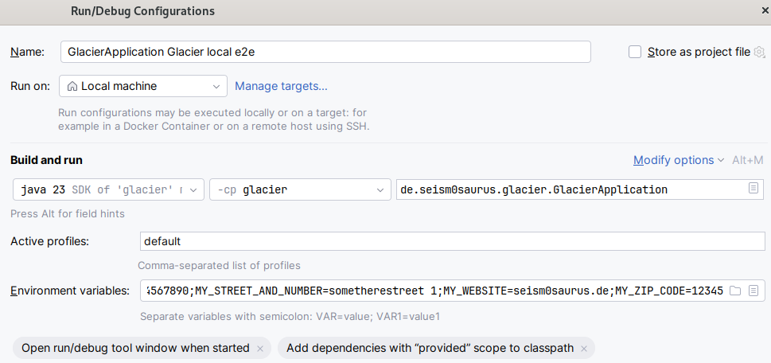

# E2E Testing

To ensure a working application when releasing and to provide feedback for developers there is an extensive end-to-end testing suite using containers.

## Content

- [Completely automated E2E Testing](#completely-automated-e2e-testing)
- [Manual E2E Testing for debugging](#manual-e2e-testing-for-debugging)


## Completely automated E2E Testing

These are the more convenient steps for end-to-end testing without the need to install playwright or run Glacier and Playwright in your IDE.

### Dependencies

To execute the end-to-end tests you need `docker` with `docker compose` functionality.
It's sad but `containerd` will not be able to run the compose file because the `traefik` loadbalancer needs a docker socket to work.

The ports `80`, `443`, `8080` and `8090` need to be free on your system, and you need the privileges to use them.

### Step by step to a successful test

- Go into a shell in the root of your local copy of the repository. Execute the maven package goal:
  ```bash
  ./mvnw clean package
  ```
- Then unpack the content of the mastodon server. Switch to the (infrastructure)[./infrastructure] folder.
  Then untar (infrastructure-content.tar.gz)[infrastructure-content.tar.gz]:
  ```bash
  cd infrastructure
  tar -xf infrastructure-content.tar.gz -C ./
  ```
- Start the infrastructure and end-to-end tests with a single command:
  ```bash
  docker compose -f docker-compose.yaml up --build --abort-on-container-exit playwright --exit-code-from playwright
  ```

## Manual E2E Testing for debugging

These are the manual steps to give you more control and the ability to debug with the tools of your IDE.

### Dependencies

To execute the end-to-end tests locally in your IDE you need additional tooling.

Java should already be configured so that you can execute the maven goals with the maven wrapper `mvnw` (or `mvnw.cmd` if you can't use unixlike OS).

You also need `docker` with `docker compose` functionality.
It's sad but `containerd` will not be able to run the compose file because the `traefik` loadbalancer needs a docker socket to work.

You also need `playwright` and browsers. We install them during the step-by-step guide.

The ports `80`, `443`, `8080` and `8090` need to be free on your system, and you need the privileges to use them.


### Step by step to a successful test

- Go into a shell in the root of your local copy of the repository. Switch to the (frontend)[../frontend] folder and install the dependencies:
  ```bash
  cd frontend
  npm install
  npx playwright install --with-deps
  ```
- Then unpack the content of the mastodon server. Switch to the (infrastructure)[./infrastructure] folder.
  Then untar (infrastructure-content.tar.gz)[infrastructure-content.tar.gz]:
  ```bash
  cd infrastructure
  tar -xf infrastructure-content.tar.gz -C ./
  ```
- Start the mastodon server with additional services and a loadbalancer. Stay in your shell and execute the following commands:
  ```bash
  docker compose -f docker-compose.only-mastodon.yaml up -d
  ```
- Wait until **all** containers are healthy. Check with the `docker compose ps`:
  ```bash
  docker compose ps
  
    NAME        IMAGE                                        COMMAND                  SERVICE     CREATED          STATUS                        PORTS
    db          postgres:14-alpine                           "docker-entrypoint.s…"   db          39 minutes ago   Up About a minute (healthy)   5432/tcp
    proxy       traefik:3                                    "/entrypoint.sh trae…"   proxy       39 minutes ago   Up 39 minutes (healthy)       0.0.0.0:80->80/tcp, [::]:80->80/tcp, 0.0.0.0:443->443/tcp, [::]:443->443/tcp, 0.0.0.0:8090->8080/tcp, [::]:8090->8080/tcp
    redis       redis:7-alpine                               "docker-entrypoint.s…"   redis       39 minutes ago   Up 39 minutes (healthy)       6379/tcp
    sidekiq     ghcr.io/mastodon/mastodon:v4.3.3             "/usr/bin/tini -- bu…"   sidekiq     39 minutes ago   Up 2 minutes (healthy)        3000/tcp
    streaming   ghcr.io/mastodon/mastodon-streaming:v4.3.3   "docker-entrypoint.s…"   streaming   39 minutes ago   Up 39 minutes (healthy)       4000/tcp
    web         ghcr.io/mastodon/mastodon:v4.3.3             "/usr/bin/tini -- bu…"   web         39 minutes ago   Up 2 minutes (healthy)        3000/tcp
  ```
- Create a Run/Debug configuration for glacier in your IDE. I use a Spring Configuration in IntelliJ IDEA, but it should be similar in other ones.
  The main class is `de.seism0saurus.glacier.GlacierApplication`. The Spring Profile is default.
  It's important to set the environment variables, to connect glacier to the containerized Mastodon server and to set the variables in the frontend.
  ```bash
    ACCESS_KEY=hMfsEYl9Hgk2Pt-iTyZyvKvfbXh9tjXV41-tsr3vRak;
    DEVMODE=true;
    HANDLE=glacier_e2e_test@proxy;
    INSTANCE=proxy;
    MY_CITY=somecity;
    MY_COUNTRY=Germany;
    MY_DOMAIN=localhost:8080;
    MY_MAIL=kontakt@seism0saurus.de;
    MY_NAME=seism0saurus;
    MY_PHONE=+1234567890;
    MY_STREET_AND_NUMBER=sometherestreet 1;
    MY_WEBSITE=seism0saurus.de;
    MY_ZIP_CODE=12345;
  ```
  Here is a screenshot of my config.

  {width=400px}
- Run the glacier configuration in your IDE
- Create a Run/Debug configuration for playwright in your IDE.
  The working directory is `frontend`.
  It's important to set the environment variables to run the tests against the local glacier instance and to publish toots in the containerized Mastodon during the tests.
  ```bash
    MASTODON_USER_API_URL=https://proxy;
    MASTODON_USER_ACCESS_TOKEN=pyPuRhw4cZJHN4QJuMX8mo9CFmziZp_BjvuCf71sV34;
    GLACIER_HANDLE=@glacier_e2e_test@proxy;
    BASE_URL=http://glacier:8080;
  ```
  {width=400px}
- Run the playwright configuration in your IDE

